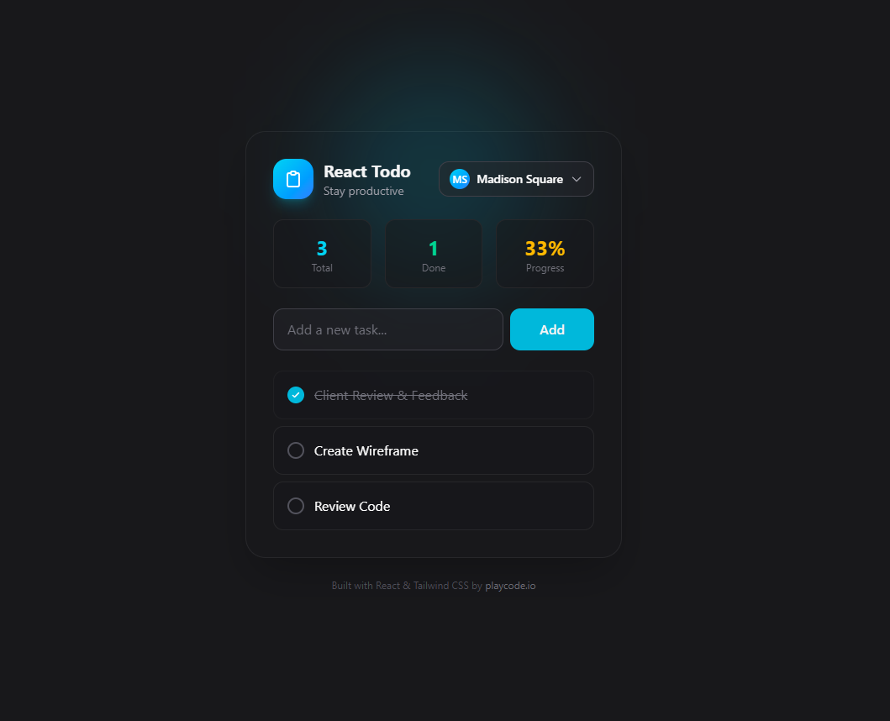
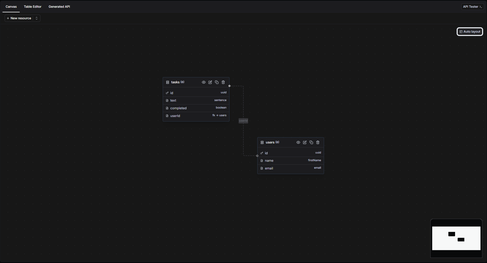
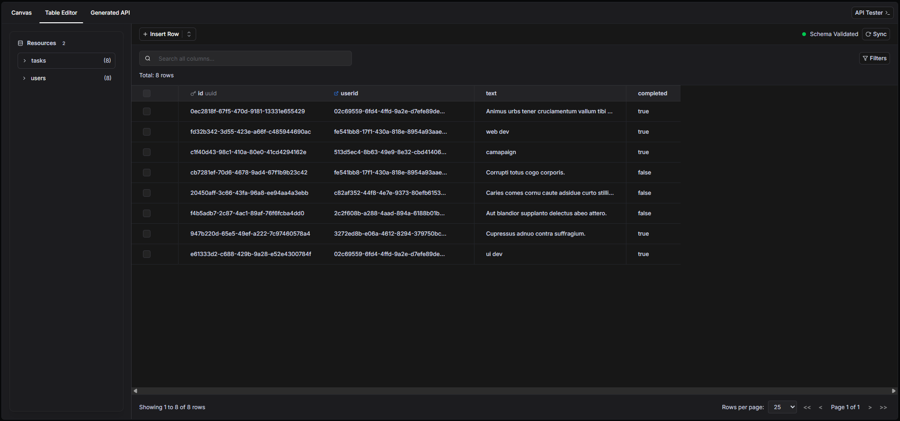

# FastDB Todo App - Frontend Example

[](https://opensource.org/licenses/MIT)

A modern, feature-rich Todo application built with React, TypeScript, and Tailwind CSS. This project serves as an example frontend implementation for [FastDB.io](https://fastdb.io), demonstrating how to integrate a React frontend with FastDB.io's REST API mock endpoints.

## 📋 About This Project

<p align="center">
  <a href="https://www.fastdb.io/" target="_blank">
    
  </a>
</p>

This Todo application was originally created by [PlayCode.io](https://playcode.io) and has been adapted as an example project for FastDB.io. It showcases a complete full-stack application pattern with:

- **User Management**: Create, edit, and manage multiple users
- **Task Management**: Create, update, delete, and toggle task completion
- **User-specific Tasks**: Each user has their own set of tasks
- **API Integration**: Seamless integration with FastDB.io mock REST APIs
- **Modern UI**: Beautiful, responsive interface built with Tailwind CSS
- **TypeScript**: Full type safety throughout the application
- **State Management**: Zustand for efficient state management

## 🚀 What is FastDB.io?

[**FastDB.io**](https://fastdb.io) is a powerful tool for creating REST API mocks quickly and easily. It allows developers to:

- **Mock REST APIs**: Generate REST endpoints instantly for prototyping and development
- **Rapid Development**: Test frontend applications without waiting for backend implementation
- **Easy Setup**: Define your data models and get working APIs in minutes
- **Real API Responses**: Simulate real backend behavior with CRUD operations
- **Development Tool**: Perfect for frontend developers who need backend endpoints during development

FastDB.io is ideal for frontend developers who want to build and test their applications independently, creating realistic API mocks that work just like a real backend. This Todo app demonstrates how easy it is to integrate a React frontend with FastDB.io's mock API endpoints.

<p align="center">
  <a href="https://www.fastdb.io/" target="_blank">
    
  </a>
</p>
<p align="center">
  <a href="https://www.fastdb.io/" target="_blank">
    
  </a>
</p>


**Visit FastDB.io**: [https://fastdb.io](https://fastdb.io)

## 🛠️ Tech Stack

- **React 19** - UI library
- **TypeScript** - Type safety
- **Vite** - Build tool and dev server
- **Tailwind CSS** - Utility-first CSS framework
- **Zustand** - State management
- **Axios** - HTTP client
- **Radix UI** - Accessible component primitives
- **Framer Motion** - Animation library
- **React Router** - Routing

## 📦 Installation

1. **Clone the repository**
   ```bash
   git clone https://github.com/jcorreadev/task-list.git
   cd task-list
   ```

2. **Install dependencies**
   ```bash
   npm install
   ```

3. **Configure environment variables**
   
   Create a `.env` file in the root directory:
   ```env
   VITE_API_BASE_URL=https://example.fastdb.io/api/project_id
   ```
   
   Replace with your FastDB.io mock API endpoint URL.

4. **Start the development server**
   ```bash
   npm run dev
   ```

5. **Open your browser**
   
   Navigate to `http://localhost:5173` (or the port shown in your terminal)

## 🏗️ Project Structure

```
todo/
├── src/
│   ├── api/                 # API services and configuration
│   │   ├── services/        # API service functions
│   │   └── index.ts         # API client setup
│   ├── components/          # React components
│   │   ├── Modal.tsx        # Reusable modal component
│   │   ├── Task.tsx         # Task item component
│   │   ├── TaskForm.tsx     # Task form component
│   │   ├── UserDropdown.tsx # User selection dropdown
│   │   ├── UserForm.tsx     # User form component
│   │   └── ...
│   ├── interfaces/          # TypeScript interfaces
│   ├── pages/               # Page components
│   │   └── Home.tsx         # Main todo page
│   ├── stores/              # Zustand stores
│   │   ├── tasks.ts         # Tasks state management
│   │   └── users.ts         # Users state management
│   └── main.tsx             # Application entry point
├── package.json
├── vite.config.ts
└── README.md
```

## 🎯 Features

### User Management
- ✅ Create new users with name and email
- ✅ Edit existing user information
- ✅ User selection dropdown with task count
- ✅ Automatic selection of first user

### Task Management
- ✅ Create tasks assigned to specific users
- ✅ Edit task text
- ✅ Mark tasks as complete/incomplete
- ✅ Delete tasks
- ✅ Real-time loading states for all operations

### Task Filtering
- ✅ Filter tasks by selected user

### User Experience
- ✅ Beautiful, modern UI design
- ✅ Responsive layout
- ✅ Loading states and skeletons
- ✅ Smooth animations
- ✅ Accessible components

## 🔌 FastDB Integration

This application integrates with FastDB.io using the following endpoints:

### Users API
- `GET /users` - Fetch all users
- `POST /users` - Create a new user
- `PUT /users/:id` - Update a user

### Tasks API
- `GET /tasks` - Fetch all tasks
- `POST /tasks` - Create a new task (requires `text` and `userId`)
- `PUT /tasks/:id` - Update a task (requires `text`, `completed`, and `userId`)
- `DELETE /tasks/:id` - Delete a task

### Data Models

**User Model:**
```typescript
{
  id: string;
  name: string;
  email?: string;
  avatar?: string;
}
```

**Task Model:**
```typescript
{
  id: string;
  text: string;
  completed: boolean;
  userId: string;
}
```

## 📝 Available Scripts

- `npm run dev` - Start development server
- `npm run build` - Build for production
- `npm run preview` - Preview production build
- `npm run lint` - Run ESLint

## 🤝 Contributing

This is an open-source project and contributions are welcome! Feel free to:

- Fork the repository
- Create a feature branch
- Make your changes
- Submit a pull request

Since this is a public project, feel free to use it as a starting point for your own applications or modify it to suit your needs.

## 📄 License

This project is open source and available under the [MIT License](LICENSE).

## 🙏 Acknowledgments

- **PlayCode.io** - Original frontend implementation
- **FastDB.io** - API mock tool and inspiration for this example
- **React Community** - Amazing ecosystem and tools

## 🔗 Links

- **FastDB.io Website**: [https://fastdb.io](https://fastdb.io)

## 📧 Support

For issues related to:
- **FastDB.io**: Visit [https://fastdb.io](https://fastdb.io) for documentation and support
- **This Project**: Open an issue in this repository

---

Made with ❤️ for the FastDB.io community
